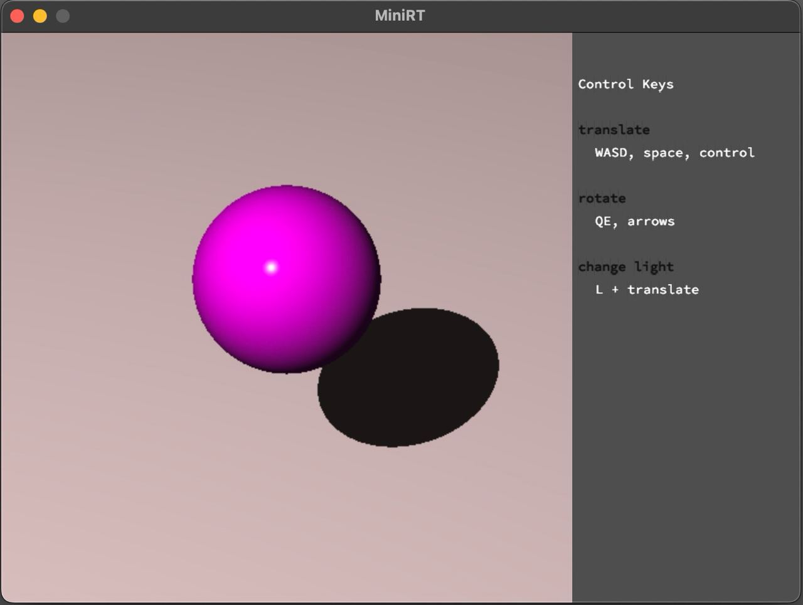
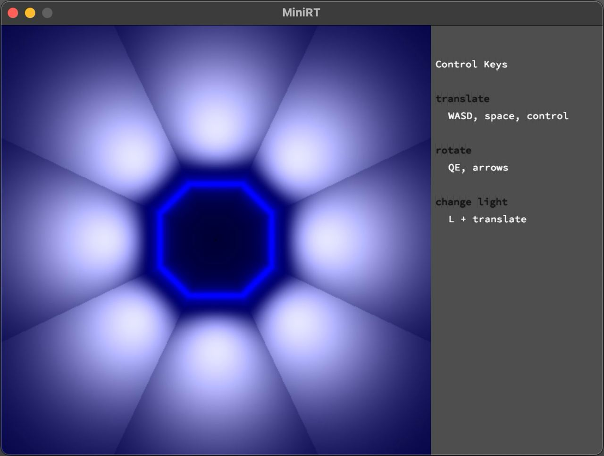

# Ray tracing engine

This project is a basic ray tracing engine. Except for a light source, it can render three types of objects: a sphere, a cylinder, and a plane. The colour of the three objects can be modified to any RGB value.

By default, the controls are tight to the camera. By clicking an object, the user can control the object (clicking the object again returns the control to the camera, and by selecting another object, the control is tight to this object). Press the L button to control the light.

The movement of the objects is relative to the axis of the world (the movement of the camera is relative to the direction of the camera).

The controls are:
- To translate / to move the camera (an object): WASD, space (up), control (down).
- To rotate the camera (an object): arrows, Q (left), E (right).

Of course, it is impossible to rotate spheres and light sources.

An object can be resized by zooming the mouse in/out.

## Usage
To run the program, an input file must be provided, specifying the scene to render. The formatting rules are in the appendix below.

You may run the following command to get the rendered ball as in the first example:
######
	./miniRT testfiles/full_files/scene02.rt

## Examples
### A ball

### A "tunnel"
Inside the space created by intersecting 8 planes and with the light source being in front

## Appendix
### Formatting rules for the input file
Each line of the input file specifies one setting. The first word is the entity to specify, followed by the parameters.

Ambient light:
A [ value of the intensity in the range [0.0,1.0] ] [ RGB in integer range [0, 255] ]:
######
	A	0.1	255,255,255
Camera:
C [coordinates of the view point] [3D normalized orientation vector] [ FOV in [0, 180] ]:
######
	C	7,5,0	-0.8,-0.6,0	20`
Light:
L [ coordinates of the light point] [the brightness ratio in [0.0, 1.0] ]:
######
	L	10,12,-5	1	255,255,255
Sphere:
sp [coordinates of the sphere centre] [diameter]
Plane:
pl [coordinates of a point in the plane] [3D normalized normal vector] [ RGB in range [0-255] ]:
######
	sp	0,0,0	1	255,51,255
Cylinder:
cy [3D normalized normal vector of the cylinder's axis] [diameter] [height] [ RGB in range [0,255] ]:
######
	cy	0,0,0	0,1,0	1 5	10,0,255

